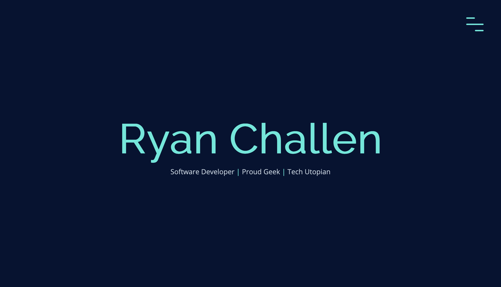

# My Portfolio Website

## updated July/Aug 2020

Deployed at www.ryanchallen.com

This portfolio website was built by me, from scratch. I wanted to build something that reflected my progress as a developer and with a little of my personal style. There are several techniques used on elements within, but I wanted to keep them relatively subtle. I am looking forward to building upon this foundation as my skills and knowledge grow.

**Tech**: HTML, CSS, JavaScript, Animate on Scroll library (AOS), deployed on Netlify
